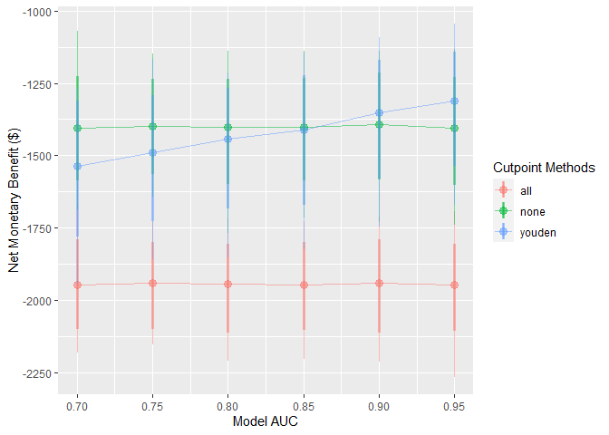
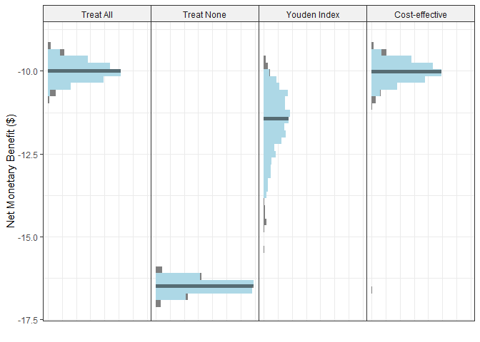

<!-- README.md is generated from README.Rmd. Please edit that file -->

# predictNMB <a href='https://rwparsons.github.io/predictNMB/'></a>

<!-- badges: start -->

[](https://github.com/RWParsons/predictNMB/actions)
[](https://www.gnu.org/licenses/gpl-3.0)
[](https://coveralls.io/r/RWParsons/predictNMB?branch=master)
<!-- badges: end -->

## Overview

predictNMB is a tool to evaluate clinical prediction models based on
their estimated Net Monetary Benefit (NMB).

`{predictNMB}` has two main functions:

- `do_nmb_sim()`: takes user defined inputs for a given prediction model
  and population, then evaluates the NMB by performing simulations.
- `screen_simulation_inputs()`: calls `do_nmb_sim()` many times, using a
  range of values for any of its inputs. This is useful for sensitivity
  analysis.

## Installation

You can install the development version from
[GitHub](https://github.com/) with:

``` r
# install.packages("devtools")
devtools::install_github("RWParsons/predictNMB")
```

## Estimating model cutpoints

We must first define a hypothetical NMB associated with each square of a
confusion matrix (2x2 table).

``` r
library(predictNMB)

fx_nmb <- get_nmb_sampler(
  outcome_cost = 100,
  high_risk_group_treatment_effect = 0.35,
  high_risk_group_treatment_cost = 10
)

fx_nmb()
#>   TP   FP   TN   FN 
#>  -75  -10    0 -100
```

We can then pass this to the simulation function. Required arguments:

- `n_sims`: number of simulations to run. More simulations take longer,
  but are more stable
- `event_rate`: event incidence rate, or the proportion of patients
  experiencing the event
- `sim_auc`: vector of hypothetical AUCs; e.g. `seq(0.7, 0.95, 0.05)` or
  `c(0.75, 0.80, 0.85)`
- `n_valid`: number of samples the validation set draws within each
  simulation (evaluating the NMB under each cutpoint)
- `fx_nmb_training`: function-defined vector used to get cutpoints on
  the training set. Recommended to use constant values
- `fx_nmb_evaluation`: function-defined vector used to get cutpoints on
  the evaluation set. Recommended to use sampled values
- `cl`: (Optional) users can pass a cluster as the. If it is passed, the
  simulations are run in parallel (faster).

``` r
library(parallel)
cl <- makeCluster(detectCores())
```

``` r
sim_screen_obj <- screen_simulation_inputs(
  n_sims = 1000, n_valid = 10000, sim_auc = seq(0.7, 0.95, 0.05), event_rate = 0.1,
  fx_nmb_training = fx_nmb, fx_nmb_evaluation = fx_nmb,
  cutpoint_methods = c("all", "none", "youden"), cl = cl
)
```

These simulations can be interpreted as a range of hypothetical
situations under different levels of model performance within our
specific healthcare setting. We can visualise how this change may affect
preferences between the model-guided strategy versus a treat-all or
treat-none strategy — in other words, using the model to determine who
should get treatment, rather than everyone or no-one.

`plot()` on the object returned from this function to quickly inspect
these trends:

``` r
plot(sim_screen_obj)
```



Here, we are visualising many simulations under different inputs. If we
just want to inspect a single set of inputs, say when the model AUC is
0.9, we can run that simulation alone using `do_nmb_sim()`, or access it
from our existing screen.

``` r
single_sim_obj <- do_nmb_sim(
  n_sims = 1000, n_valid = 10000, sim_auc = 0.9, event_rate = 0.1,
  fx_nmb_training = fx_nmb, fx_nmb_evaluation = fx_nmb,
  cutpoint_methods = c("all", "none", "youden"), cl = cl
)
```

``` r
single_sim_obj <- sim_screen_obj$simulations[[6]]
```

When plotting a single set of simulation inputs, we see the
distributions of the NMB across all simulations under each strategy.

``` r
plot(single_sim_obj)
```



## Further reading

The [`predictNMB` website](https://rwparsons.github.io/predictNMB/) and
its vignettes:

- [Introduction to
  `predictNMB`](https://rwparsons.github.io/predictNMB/articles/introduction-to-predictNMB.html)
- [Summarising results from
  `predictNMB`](https://rwparsons.github.io/predictNMB/articles/summarising-results-with-predictNMB.html)
- [Detailed example: pressure injury
  model](https://rwparsons.github.io/predictNMB/articles/detailed-example.html)
- [Creating NMB
  functions](https://rwparsons.github.io/predictNMB/articles/creating-nmb-functions.html)
