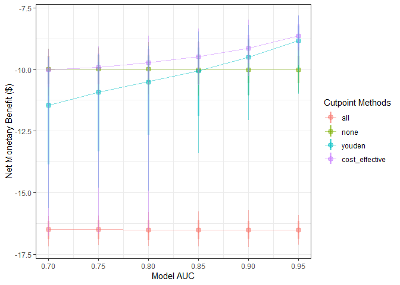
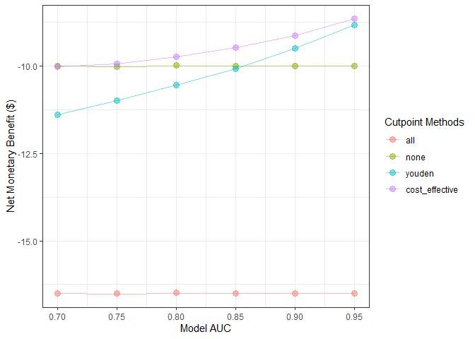
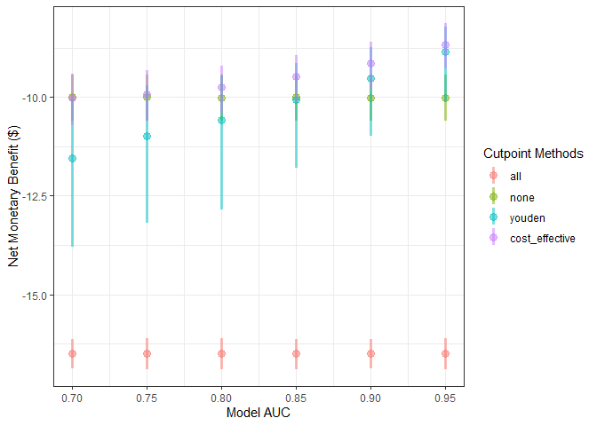
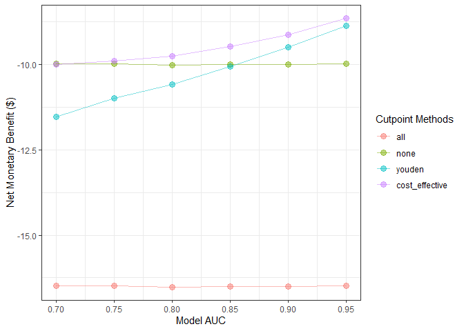
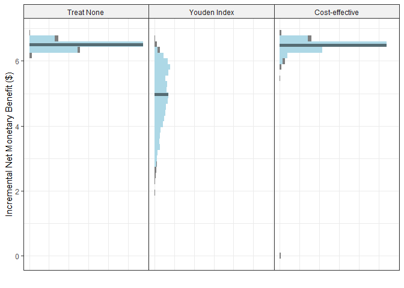
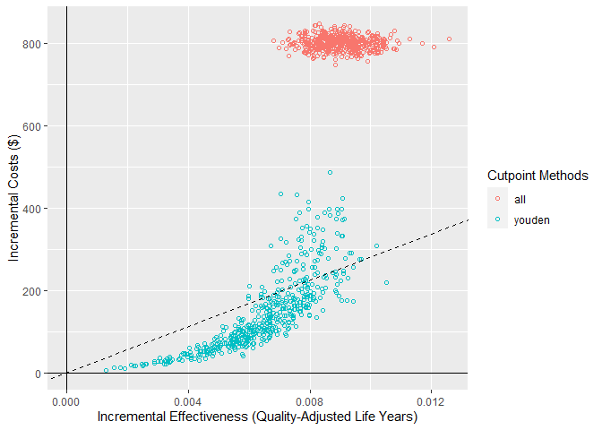

<!-- README.md is generated from README.Rmd. Please edit that file -->

# predictNMB <a href='https://github.com/RWParsons/predictNMB'></a>

<!-- badges: start -->

[](https://github.com/RWParsons/predictNMB/actions)
[](https://www.gnu.org/licenses/gpl-3.0)
<!-- badges: end -->

## Overview

predictNMB is a tool to evaluate hypothetical clinical prediction models
based on their estimated Net Monetary Benefit (NMB).

`{predictNMB}` has two main functions:

-   `do_nmb_sim()`: takes user defined inputs for a given prediction
    model and population, then evaluates the NMB by performing
    simulations.
-   `screen_simulation_inputs()`: calls `do_nmb_sim()` many times, using
    a range of values for any of its inputs. This is useful for
    sensitivity analysis.

## Installation

You can install the development version of predictNMB from
[GitHub](https://github.com/) with:

``` r
# install.packages("devtools")
devtools::install_github("RWParsons/predictNMB")
```

## Example

``` r
library(predictNMB)
```

Evaluating a hypothetical model for predicting and preventing an adverse
event using a confusion matrix (2 x 2 table).

Model inputs:

-   Cost of adverse event for untreated patient = $100
-   Cost of adverse event for treated patient = $65
-   Cost of treatment per patient = $10

``` r
fx_nmb <- function() {
  c(
    "TP" = -75, # True positive: Correctly predicted event = cost of event for treated patient ($650) + cost of treatment ($100)
    "FP" = -10, # False positive: Cost of (unnecessary) treatment from incorrectly predicted positive
    "TN" = 0,  # True negative: No cost of treatment or event from correctly predicted negative
    "FN" = -100 # False negative: Full cost of event from incorrectly predicted negative
  )
}

fx_nmb()
#>   TP   FP   TN   FN 
#>  -75  -10    0 -100
```

These inputs can be passed to `screen_simulation_inputs()` under the
parameters `fx_nmb_training` and `fx_nmb_evaluation`, to be evaluated in
each simulation. The following function assesses the required
performance for the model to outperform a default strategy of treat all
or treat none. In this example, cutpoints are selected using the Youden
index and the cost-effectiveness approach, which maximises NMB.

Inputs:

-   `event_rate`: event incidence rate = 0.10
-   `sim_auc`: vector of hypothetical AUC = `seq(0.7, 0.95, 0.05)`
-   `n_valid`: number of samples for validation dataset within each
    simulation (evaluating the NMB under each cutpoint)

Optional: Users can pass a cluster as the `cl` argument. If it is
passed, the simulations are run in parallel (faster).

``` r
cl <- parallel::makeCluster(parallel::detectCores())
sim_screen_obj <- screen_simulation_inputs(
  n_sims = 1000, n_valid = 10000, sim_auc = seq(0.7, 0.95, 0.05), event_rate = 0.1,
  fx_nmb_training = fx_nmb, fx_nmb_evaluation = fx_nmb,
  cutpoint_methods = c("all", "none", "youden", "cost_effective"), cl = cl
)
```

`plot()` can be used to generate plots of the many simulations.

``` r
plot(sim_screen_obj)
#> No value for 'x_axis_var' given.
#> Screening over sim_auc by default
```



In this example, the Youden index outperforms the ‘treat all’ approach
when AUC is at least 0.85 or higher. The cost-effective approach is
similar to ‘treat all’ at low levels of AUC, but improves as AUC
increases to stay ahead of the Youden index.

The plot method includes additional arguments to rename the methods
using a named vector. It can also be used to visualise cutpoints or the
Incremental Net Monetary Benefit (INB) when there’s a known reference
strategy.

``` r
plot(
  sim_screen_obj, 
  rename_vector=c("Treat All" = "all", "Treat None" = "none", "Youden Index" = "youden", "Cost-effective" = "cost_effective")
)
#> No value for 'x_axis_var' given.
#> Screening over sim_auc by default
```


``` r
plot(
  sim_screen_obj, 
  rename_vector=c("Treat All" = "all", "Treat None" = "none", "Youden Index" = "youden", "Cost-effective" = "cost_effective"),
  what="inb",
  inb_ref_col="Treat All"
)
#> No value for 'x_axis_var' given.
#> Screening over sim_auc by default
```



By default, the median (dot), 95% interval (thick vertical line), range
(skinny vertical line), and lines between points are shown. All except
the dots can be optionally turned off or on, and the width of the
interval can be controlled with `ci`.

``` r
plot(
  sim_screen_obj,
  plot_line = FALSE,
  plot_range = FALSE,
  plot_ci = 0.8
)
#> No value for 'x_axis_var' given.
#> Screening over sim_auc by default
```



``` r
plot(
  sim_screen_obj,
  plot_line = TRUE,
  plot_range = FALSE,
  plot_ci = 0
)
#> No value for 'x_axis_var' given.
#> Screening over sim_auc by default
```



The simulations for a given set of inputs can be accessed from our
`predictNMBscreen` object (`sim_screen_obj`). These are the same as the
output from `do_nmb_sim()` and have their own methods as well.

``` r
sim_screen_obj$simulations
#> [[1]]
#> predictNMB object
#> 
#> Training data sample size:  189
#> Minimum number of events in training sample:  19
#> Evaluation data sample size:  10000
#> Number of simulations:  1000
#> Simulated AUC:  0.7
#> Simulated event rate:  0.1
#> [[2]]
#> predictNMB object
#> 
#> Training data sample size:  139
#> Minimum number of events in training sample:  14
#> Evaluation data sample size:  10000
#> Number of simulations:  1000
#> Simulated AUC:  0.75
#> Simulated event rate:  0.1
#> [[3]]
#> predictNMB object
#> 
#> Training data sample size:  139
#> Minimum number of events in training sample:  14
#> Evaluation data sample size:  10000
#> Number of simulations:  1000
#> Simulated AUC:  0.8
#> Simulated event rate:  0.1
#> [[4]]
#> predictNMB object
#> 
#> Training data sample size:  139
#> Minimum number of events in training sample:  14
#> Evaluation data sample size:  10000
#> Number of simulations:  1000
#> Simulated AUC:  0.85
#> Simulated event rate:  0.1
#> [[5]]
#> predictNMB object
#> 
#> Training data sample size:  139
#> Minimum number of events in training sample:  14
#> Evaluation data sample size:  10000
#> Number of simulations:  1000
#> Simulated AUC:  0.9
#> Simulated event rate:  0.1
#> [[6]]
#> predictNMB object
#> 
#> Training data sample size:  139
#> Minimum number of events in training sample:  14
#> Evaluation data sample size:  10000
#> Number of simulations:  1000
#> Simulated AUC:  0.95
#> Simulated event rate:  0.1
sim_obj <- sim_screen_obj$simulations[[1]]

sim_obj
#> predictNMB object
#> 
#> Training data sample size:  189
#> Minimum number of events in training sample:  19
#> Evaluation data sample size:  10000
#> Number of simulations:  1000
#> Simulated AUC:  0.7
#> Simulated event rate:  0.1
```

Here, using the `predictNMBsim` object, the plot shows the median as the
solid bar within the distribution and the light blue portion of the
distribution is the 95% interval (level can be changed using the `ci`
argument).

``` r
plot(sim_obj)
```


``` r
plot(sim_obj, ci=0.50)
```



The plot methods for both the `predictNMBscreen` and `predictNMBsim`
objects have almost the same usage of arguments.

``` r
plot(
  sim_obj, 
  rename_vector=c("Treat All" = "all", "Treat None" = "none", "Youden Index" = "youden", "Cost-effective" = "cost_effective")
)
```



``` r
plot(
  sim_obj, 
  rename_vector=c("Treat All" = "all", "Treat None" = "none", "Youden Index" = "youden", "Cost-effective" = "cost_effective"),
  what="inb",
  inb_ref_col="Treat All"
)
```


