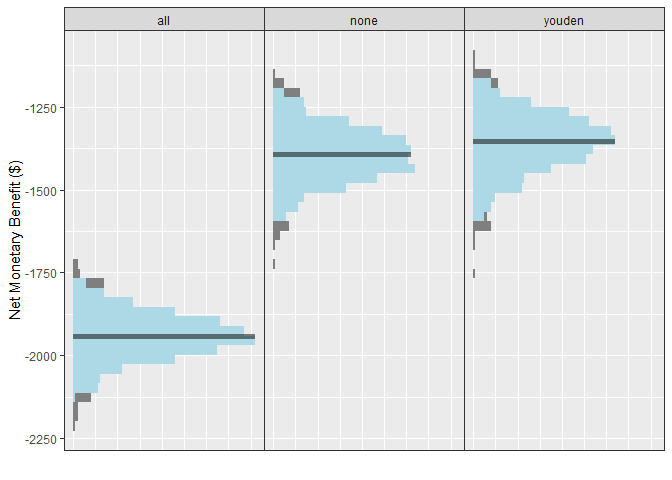

<!-- README.md is generated from README.Rmd. Please edit that file -->

# predictNMB <a href='https://github.com/RWParsons/predictNMB'></a>

<!-- badges: start -->

[](https://github.com/RWParsons/predictNMB/actions)
<!-- badges: end -->

The goal of predictNMB is to evaluate a hypothetical clinical prediction
model regarding it’s Net Monetary Benefit (NMB)

## Installation

You can install the development version of predictNMB from
[GitHub](https://github.com/) with:

``` r
# install.packages("devtools")
devtools::install_github("RWParsons/predictNMB")
```

## Example

``` r
library(predictNMB)
```

`{predictNMB}` has two main functions:

-   `do_nmb_sim()`: using settings from the user for the prediction
    model and “patient” population, evaluates the NMB by performing many
    simulations.
-   `screen_simulation_inputs()`: calls `do_nmb_sim()` many times using
    a range values for any of its inputs.

The most time consuming part of evaluating the NMB for a given setting
and model will be obtaining realistic estimates for the NMB associated
with the outcomes of the prediction model.

Here, I pretend that the cost associated with some healthcare event is
$100, when the treatment (that costs $10) is given, this reduces the
probability that the $100 event occurs by 35% (reducing cost to $65) but
has the additional cost of the treatment (bringing the total expected
cost to $75), and patients that were correctly predicted to not have the
event have zero cost.

``` r
fx_nmb <- function() {
  c(
    "TP" = -75, # cost of the outcome + cost of treatment - saving associated with its effectiveness
    "FP" = -10, # cost of treatment
    "TN" = 0,  # no cost of treatment or outcome
    "FN" = -100 # full cost of the outcome
  )
}

fx_nmb()
#>   TP   FP   TN   FN 
#>  -75  -10    0 -100
```

We use this as an inputs so that the NMB can be evaluated for each
simulation.

In the simulation below, I want to see how performant I need my model to
be to out perform a treat-all or treat-none strategy (i.e. how good does
a model need to be to be better than no model at all). I’m going to
select cutpoints using the Youden index as well as the cost_effective
cutpoint.

The event that I’m interested in happens to 10% of my patient population
so I use `event_rate = 0.1`. I’m going to provide a vector of possible
inputs for the model AUC so I use `sim_auc = seq(0.7, 0.95, 0.05)`.

It’s optional to pass a cluster as the `cl` argument. If it is passed,
the simulations are run in parallel (faster).

``` r
cl <- parallel::makeCluster(parallel::detectCores())
sim_screen_obj <- screen_simulation_inputs(
  n_sims = 1000, n_valid = 10000, sim_auc = seq(0.7, 0.95, 0.05), event_rate = 0.1,
  fx_nmb_training = fx_nmb, fx_nmb_evaluation = fx_nmb,
  cutpoint_methods = c("all", "none", "youden", "cost_effective"), cl = cl
)
```

`plot()` can be used to generate plots of the many simulations.

``` r
plot(sim_screen_obj)
#> No value for 'x_axis_var' given.
#> Screening over sim_auc by default
```


In this example, the cost of the treatment is relatively cheap ($10) to
the effectiveness (reduces risk of outcome by 35%) of it and the cost of
the outcome ($100). The Youden index, which is a pretty commonly used
method to obtain a cutpoint, out performs treat-all when the model has
an AUC of about 0.85 or higher. Whereas, the cost-effective cutpoint
starts out similar to treat-all even at low levels of model AUC, but
improves as the AUC increases, staying ahead of the Youden index.

The plot method includes additional arguments to rename the methods
using a named vector. It can also be used to visualise cutpoints or the
Incremental Net Monetary Benefit (INB) when there’s a known reference
strategy.

``` r
plot(
  sim_screen_obj, 
  rename_vector=c("Treat All" = "all", "Treat None" = "none", "Youden Index" = "youden", "Cost-effective" = "cost_effective")
)
#> No value for 'x_axis_var' given.
#> Screening over sim_auc by default
```


``` r
plot(
  sim_screen_obj, 
  rename_vector=c("Treat All" = "all", "Treat None" = "none", "Youden Index" = "youden", "Cost-effective" = "cost_effective"),
  what="inb",
  inb_ref_col="Treat All"
)
#> No value for 'x_axis_var' given.
#> Screening over sim_auc by default
```

 By
default, the median (dot), 95% interval (thick vertical line), range
(skinny vertical line), and lines between points are shown. All except
the dots can be optionally turned off or on, and the width of the
interval can be controlled with `ci`

``` r
plot(
  sim_screen_obj,
  plot_line = FALSE,
  plot_range = FALSE,
  plot_ci = 0.8
)
#> No value for 'x_axis_var' given.
#> Screening over sim_auc by default
```


``` r
plot(
  sim_screen_obj,
  plot_line = TRUE,
  plot_range = FALSE,
  plot_ci = 0
)
#> No value for 'x_axis_var' given.
#> Screening over sim_auc by default
```


The simulations for a given set of inputs can be accessed from our
`predictNMBscreen` object (`sim_screen_obj`). These are the same as the
output from `do_nmb_sim()` and have their own methods as well. Here, the
plot shows the median as the solid bar within the distribution and the
light blue portion of the distribution is the 95% interval (level can be
changed using the `ci` argument).

``` r
sim_screen_obj$simulations
#> [[1]]
#> predictNMB object
#> 
#> Training data sample size:  189
#> Evaluation data sample size:  10000
#> Number of simulations:  1000
#> Simulated AUC:  0.7
#> Simulated event rate:  0.1
#> [[2]]
#> predictNMB object
#> 
#> Training data sample size:  139
#> Evaluation data sample size:  10000
#> Number of simulations:  1000
#> Simulated AUC:  0.75
#> Simulated event rate:  0.1
#> [[3]]
#> predictNMB object
#> 
#> Training data sample size:  139
#> Evaluation data sample size:  10000
#> Number of simulations:  1000
#> Simulated AUC:  0.8
#> Simulated event rate:  0.1
#> [[4]]
#> predictNMB object
#> 
#> Training data sample size:  139
#> Evaluation data sample size:  10000
#> Number of simulations:  1000
#> Simulated AUC:  0.85
#> Simulated event rate:  0.1
#> [[5]]
#> predictNMB object
#> 
#> Training data sample size:  139
#> Evaluation data sample size:  10000
#> Number of simulations:  1000
#> Simulated AUC:  0.9
#> Simulated event rate:  0.1
#> [[6]]
#> predictNMB object
#> 
#> Training data sample size:  139
#> Evaluation data sample size:  10000
#> Number of simulations:  1000
#> Simulated AUC:  0.95
#> Simulated event rate:  0.1
sim_obj <- sim_screen_obj$simulations[[1]]

sim_obj
#> predictNMB object
#> 
#> Training data sample size:  189
#> Evaluation data sample size:  10000
#> Number of simulations:  1000
#> Simulated AUC:  0.7
#> Simulated event rate:  0.1
plot(sim_obj)
```


``` r
plot(sim_obj, ci=0.50)
```

 The
plot methods for both the `predictNMBscreen` and `predictNMBsim` objects
have almost the same usage of arguments.

``` r
plot(
  sim_obj, 
  rename_vector=c("Treat All" = "all", "Treat None" = "none", "Youden Index" = "youden", "Cost-effective" = "cost_effective")
)
```



``` r
plot(
  sim_obj, 
  rename_vector=c("Treat All" = "all", "Treat None" = "none", "Youden Index" = "youden", "Cost-effective" = "cost_effective"),
  what="inb",
  inb_ref_col="Treat All"
)
```


